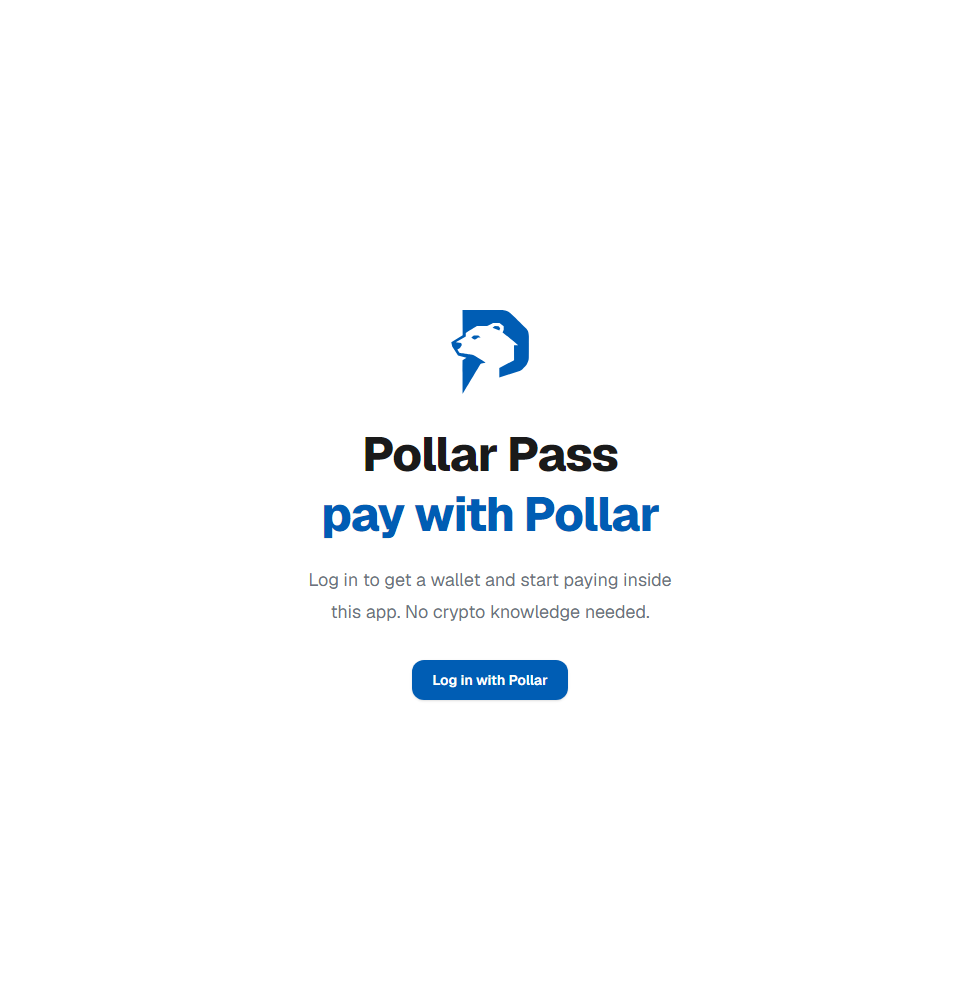
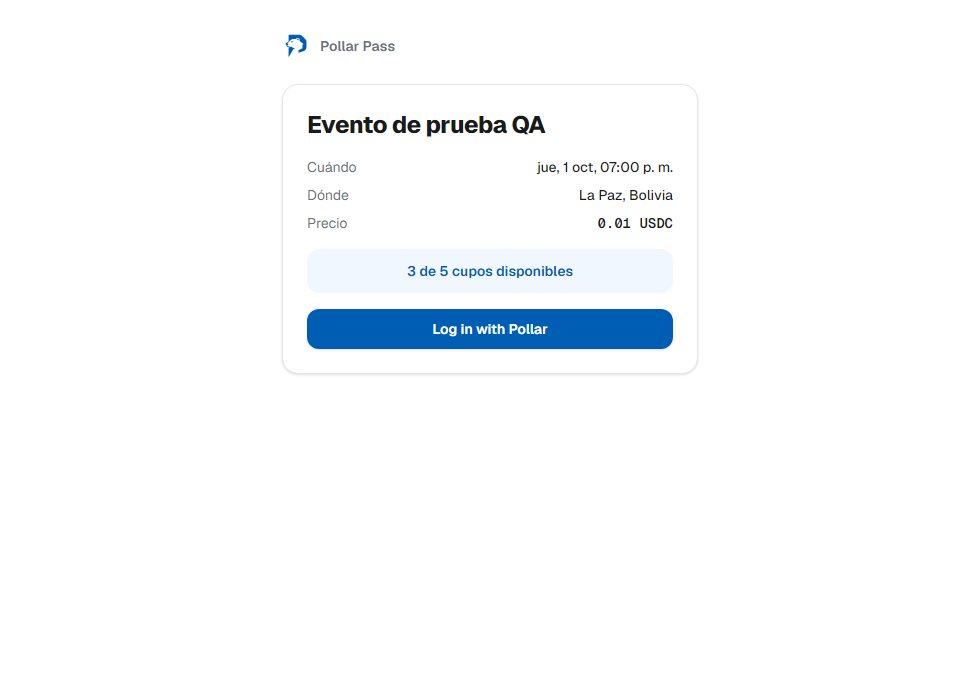

# Documentación visual — Pollar Pass

Tablero completo (arquitectura, flujos y capturas), editable en Figma/FigJam:

**https://www.figma.com/board/OwFBSZmDTqxdJ1jHZfe4Km**

## Qué incluye el tablero

| Sección | Contenido |
|---|---|
| Portada | Resumen del proyecto, stack y links |
| Arquitectura general | Comprador/Organizador ↔ Next.js (páginas + rutas API) ↔ Pollar SDK ↔ Stellar Testnet / Horizon ↔ Base de datos (Turso) ↔ Resend |
| Flujo de compra de ticket | Los 9 pasos, desde abrir el link del evento hasta que el ticket queda validado en la puerta |
| Check-in en la puerta | Escaneo o código manual → validación atómica en la base de datos → los 3 resultados posibles (válido / usado / desconocido) |
| Estados de una venta | Ciclo de vida de una venta: `pending` → `paid` / `expired` / `unclaimed` |
| Capturas reales de la app | Pantallas reales de producción |

## Capturas reales (producción)

Producción: https://pollarpass.vercel.app
